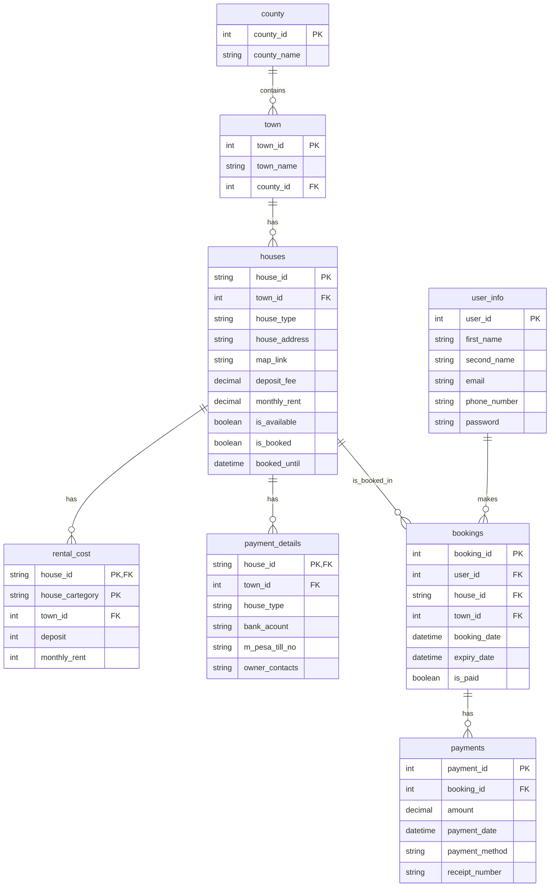

# M-boma Housing Project

## Overview
M-boma Housing Project is a C++ application designed to help tenants find and book their desired houses for rent across various counties. The project was developed as part of a Computer Programming Unit at the university.

**Important Note:** This application requires a MySQL database connection to function. All data is loaded from the database, and there is no fallback to hardcoded sample data.

## Table of Contents
- [Overview](#overview)
- [Features](#features)
- [Project History and Archive](#project-history-and-archive)
- [Project Structure](#project-structure)
- [Setup & Installation](#setup--installation)
- [Usage](#usage)
- [Troubleshooting](#troubleshooting)
- [Common Code Issues and Fixes](#common-code-issues-and-fixes)
- [Database Configuration Details](#database-configuration-details)
- [Security Considerations](#security-considerations)
- [Project Dependencies](#project-dependencies)
- [Running in Production](#running-in-production)
- [Contributing](#contributing)
- [License](#license)

## Features
- User registration (Name, Phone, Email, Password) with secure password hashing
- Navigation through sampled counties (e.g., Nairobi, Mombasa, Kisumu)
- View main towns and available houses in each town
- Display house details: type, deposit fee, monthly rent, and map link
- Advanced house search functionality by type, price range, or location
- Multiple payment options (M-Pesa, bank)
- Receipt generation for payments
- House booking with a 30-day grace period
- Database integration for persistent storage
- Error handling and data validation

## Project History and Archive

The `/Archive` directory contains the original version of the project that was developed during university studies after learning C/C++ on February 17, 2020. This early work has been preserved to document the evolution of the project and to appreciate the initial implementation that laid the foundation for the current system.

The archived version represents my first significant programming project after learning the basics of C/C++, showcasing the application of fundamental programming concepts in a real-world context. It follows a more straightforward, monolithic design typical of early programming projects.

Key improvements in the current implementation over the archived university project:
- Refactored from a monolithic design to a modular, object-oriented architecture
- Enhanced database schema with proper relationships and constraints
- Improved user interface and interaction flow
- Added comprehensive error handling and validation
- Implemented secure password handling and SQL injection protection
- Created detailed documentation and setup instructions

The archived version provides valuable historical context for understanding the project's origins and my personal development journey as a programmer.

## Project Structure
```
├── Archive/                         # Previous version of the project
│   ├── README.md                    # Original project description
│   ├── database/                    # Original database schema
│   │   └── housing_database.sql
│   └── source_code/                 # Original source code implementation
│       ├── boma_main.cpp
│       ├── boma.cpp
│       └── boma.h
├── database/
│   └── create_database.sql         # Enhanced SQL database schema
├── src/
│   ├── main.cpp                    # Main application entry point
│   ├── MBomaHousingSystem.cpp      # Core system implementation
│   ├── User.cpp                    # User class implementation
│   ├── Location.cpp                # Location class implementation
│   ├── House.cpp                   # House class implementation
│   ├── Booking.cpp                 # Booking class implementation  
│   ├── Payment.cpp                 # Payment class implementation
│   ├── DBConnector.cpp             # Database connector implementation
│   ├── Utils.cpp                   # Utility functions
│   └── include/                    # Header files
│       ├── MBomaHousingSystem.h
│       ├── User.h
│       ├── Location.h
│       ├── House.h
│       ├── Booking.h
│       ├── Payment.h
│       ├── DBConnector.h
│       ├── DBConfig.h
│       └── Utils.h
├── Makefile                        # Build configuration
└── README.md                       # Project documentation
```

## Setup & Installation

### Prerequisites
1. Clone the repository:
   ```bash
   git clone <repository-url>
   cd m_boma-housing-project
   ```

### MySQL Server Setup

1. Check if MySQL server is installed and running:
   ```bash
   systemctl status mysql
   ```

2. If MySQL is not installed, install it:
   ```bash
   sudo apt-get update
   sudo apt-get install -y mysql-server
   ```

3. If MySQL is installed but not running, start it:
   ```bash
   sudo systemctl start mysql
   sudo systemctl enable mysql
   ```

4. Install required development libraries:
   ```bash
   sudo apt-get install -y libmysqlclient-dev libssl-dev
   ```

### MySQL Server Management

1. Start MySQL server:
   ```bash
   sudo systemctl start mysql
   ```

2. Stop MySQL server:
   ```bash
   sudo systemctl stop mysql
   ```

3. Restart MySQL server:
   ```bash
   sudo systemctl restart mysql
   ```

4. Check MySQL server status:
   ```bash
   sudo systemctl status mysql
   ```

5. Enable MySQL server to start on boot:
   ```bash
   sudo systemctl enable mysql
   ```

6. Disable MySQL server automatic startup:
   ```bash
   sudo systemctl disable mysql
   ```

### Database Setup

The project includes an `update_db.sh` script that simplifies the process of setting up and resetting the database with sample data. This script requires sudo privileges as it executes MySQL commands as the root user.

1. Create the database, user, and grant permissions:
   ```bash
   sudo mysql -e "CREATE DATABASE IF NOT EXISTS mboma_housing; \
                  CREATE USER IF NOT EXISTS 'mboma_user'@'localhost' IDENTIFIED BY 'mboma_password'; \
                  GRANT ALL PRIVILEGES ON mboma_housing.* TO 'mboma_user'@'localhost'; \
                  FLUSH PRIVILEGES;"
   ```

2. Import the database schema:
   ```bash
   mysql -umboma_user -pmboma_password < database/create_database.sql
   ```
   
   Alternatively, you can use the provided convenience script to import the database schema with root privileges:
   ```bash
   # Make sure the script is executable
   chmod +x update_db.sh
   
   # Run the script
   ./update_db.sh
   ```
   This script uses sudo to execute the SQL commands, which is useful if you have permission issues with the direct mysql command.

3. Verify the database connection credentials in `src/include/DBConfig.h`:
   ```cpp
   const std::string DB_HOST = "localhost";
   const std::string DB_USER = "mboma_user";
   const std::string DB_PASS = "mboma_password";
   const std::string DB_NAME = "mboma_housing";
   ```

### Build the Project

1. Create required directories:
   ```bash
   mkdir -p obj bin
   ```

2. Compile the project:
   ```bash
   make clean && make
   ```

## Usage

1. Run the compiled program:
   ```bash
   ./bin/mboma
   ```

Follow the on-screen instructions to:
1. Register a new account or login with existing credentials
2. Browse through counties and towns to find available houses
3. View detailed information about houses including price and location
4. Book houses and make payments using different methods
5. Generate and view payment receipts

## Troubleshooting

### Database Connection Issues

1. Verify MySQL server is running:
   ```bash
   systemctl status mysql
   ```

2. Check database credentials in `src/include/DBConfig.h`:
   ```cpp
   const std::string DB_HOST = "localhost";
   const std::string DB_USER = "mboma_user";
   const std::string DB_PASS = "mboma_password";
   const std::string DB_NAME = "mboma_housing";
   ```

3. Verify the user has proper permissions:
   ```bash
   sudo mysql -e "SHOW GRANTS FOR 'mboma_user'@'localhost';"
   ```

4. Verify database schema:
   ```bash
   mysql -umboma_user -pmboma_password -e "USE mboma_housing; SHOW TABLES;"
   ```

5. If you encounter permission issues when importing the database schema, use the provided script:
   ```bash
   # Make sure the script is executable
   chmod +x update_db.sh
   
   # Run the script
   ./update_db.sh
   ```
   This script executes the SQL commands with sudo privileges, which can help bypass permission issues.

### Database Verification and Sample Queries

#### Check if Database Exists

```bash
# List all databases to verify mboma_housing exists
mysql -umboma_user -pmboma_password -e "SHOW DATABASES;"

# Check if database user has proper permissions
mysql -umboma_user -pmboma_password -e "SHOW GRANTS FOR CURRENT_USER;"
```

#### Check Database Tables and Structure

```bash
# List all tables in the database
mysql -umboma_user -pmboma_password -e "USE mboma_housing; SHOW TABLES;"

# View table structure
mysql -umboma_user -pmboma_password -e "USE mboma_housing; DESCRIBE user_info;"
mysql -umboma_user -pmboma_password -e "USE mboma_housing; DESCRIBE houses;"
mysql -umboma_user -pmboma_password -e "USE mboma_housing; DESCRIBE town;"
```

#### Sample Queries

```bash
# View all counties/towns
mysql -umboma_user -pmboma_password -e "USE mboma_housing; SELECT * FROM town;"

# View all houses
mysql -umboma_user -pmboma_password -e "USE mboma_housing; SELECT * FROM houses;"

# View available houses
mysql -umboma_user -pmboma_password -e "USE mboma_housing; SELECT * FROM houses WHERE is_available = TRUE;"

# View houses in a specific town
mysql -umboma_user -pmboma_password -e "USE mboma_housing; SELECT h.house_id, h.house_type, t.town_name FROM houses h JOIN town t ON h.town_id = t.town_id WHERE t.town_name = 'Karen';"

# View rental prices
mysql -umboma_user -pmboma_password -e "USE mboma_housing; SELECT h.house_type, t.town_name, rc.deposit, rc.monthly_rent FROM rental_cost rc JOIN houses h ON rc.house_id = h.house_id AND rc.town_id = h.town_id JOIN town t ON h.town_id = t.town_id;"
```

#### Run SQL Script File

If you've already created your own database schema file:

```bash
# Import a custom schema file
mysql -umboma_user -pmboma_password mboma_housing < path/to/your/schema.sql
```

#### Interactive MySQL Session

For more complex queries or database exploration:

```bash
# Start an interactive MySQL session
mysql -umboma_user -pmboma_password mboma_housing

# Then you can run any SQL commands, for example:
mysql> SELECT * FROM houses;
mysql> SELECT * FROM user_info;
mysql> \q  # To quit the MySQL interactive session
```

### Database Backup and Restoration

#### Backup the Database

```bash
# Create a full database backup
mysqldump -umboma_user -pmboma_password mboma_housing > mboma_backup.sql

# Backup specific tables
mysqldump -umboma_user -pmboma_password mboma_housing houses town > houses_towns_backup.sql

# Create a compressed backup
mysqldump -umboma_user -pmboma_password mboma_housing | gzip > mboma_backup.sql.gz
```

#### Restore the Database

```bash
# Restore from a backup file
mysql -umboma_user -pmboma_password mboma_housing < mboma_backup.sql

# Restore from a compressed backup
gunzip < mboma_backup.sql.gz | mysql -umboma_user -pmboma_password mboma_housing

# Reset the database to its original state using the update_db.sh script
chmod +x update_db.sh  # Ensure the script is executable
./update_db.sh
```

This last option completely resets the database to its original state with the sample data from the SQL script, which is useful during development or when you want to start fresh.

#### Schedule Regular Backups

Add to your crontab for automated backups:

```bash
# Edit crontab
crontab -e

# Add this line to run a backup every day at 2 AM
0 2 * * * mysqldump -umboma_user -pmboma_password mboma_housing > /path/to/backup/mboma_$(date +\%Y\%m\%d).sql
```

### Compilation Errors

1. Missing header files:
   - Ensure all required packages are installed:
     ```bash
     sudo apt-get install -y libmysqlclient-dev libssl-dev
     ```

2. Makefile issues:
   - Verify the Makefile has proper tab indentation (not spaces)
   - Ensure target directories exist:
     ```bash
     mkdir -p obj bin
     ```

3. MySQL C API errors:
   - Check MySQL C API development headers:
     ```bash
     ls -l /usr/include/mysql
     ```
   - If missing, reinstall:
     ```bash
     sudo apt-get install --reinstall libmysqlclient-dev
     ```

### Runtime Errors

1. Database schema inconsistencies:
   - Rerun the database creation script:
     ```bash
     mysql -umboma_user -pmboma_password < database/create_database.sql
     ```

2. Permission errors:
   - Ensure the binary is executable:
     ```bash
     chmod +x bin/mboma
     ```

## Common Code Issues and Fixes

When working with this project, you might encounter the following code issues:

### Missing Header Includes

The following headers are required in `DBConnector.cpp`:
```cpp
#include <map>       // For std::map
#include <sstream>   // For std::stringstream
#include <iomanip>   // For std::put_time
```

The following header is required in `DBConnector.h`:
```cpp
#include <map>       // For std::map
```

### Variable Declaration in Switch Statements

When using switch statements with case labels, ensure variables are declared outside the switch block to avoid "jump to case label" errors:

```cpp
// Incorrect
switch(choice) {
    case 1:
        std::string name;  // Variable declaration within a case
        // ...
        break;
}

// Correct
std::string name;  // Declare outside switch
switch(choice) {
    case 1:
        // Use the variable
        break;
}
```

### Constructor Initialization Order

Ensure member variables are initialized in the same order they are declared in the class to avoid reordering warnings:

```cpp
// In header: DBConnector* dbConnector; followed by bool isLoggedIn;

// Incorrect initialization order
Constructor() : isLoggedIn(false), dbConnector(nullptr) { }

// Correct initialization order
Constructor() : dbConnector(nullptr), isLoggedIn(false) { }
```

## Database Configuration Details

### Database Entity Relationship Diagram (ERD)

The following diagram shows the Entity Relationship Diagram (ERD) for the M-boma Housing Project database. It illustrates all tables, their relationships, primary and foreign keys, and the cardinality between entities.



**ERD Notation Explanation:**
- `PK`: Primary Key
- `FK`: Foreign Key
- `||--o{`: One-to-many relationship (One entity on the left, many entities on the right)
- Table fields are listed with their data types

### Database Configuration

The database configuration is stored in `src/include/DBConfig.h`:

```cpp
namespace DBConfig {
    // Database connection parameters
    const std::string DB_HOST = "localhost";
    const std::string DB_USER = "mboma_user";  // MySQL username
    const std::string DB_PASS = "mboma_password";  // MySQL password
    const std::string DB_NAME = "mboma_housing";
    
    // Connection retry settings
    const int CONNECTION_RETRY_ATTEMPTS = 3;
    const int CONNECTION_RETRY_DELAY_MS = 1000;
}
```

The application is configured to retry the database connection up to 3 times with a 1-second delay between attempts if the initial connection fails.

## Security Considerations

1. **Password Hashing**: User passwords are hashed using SHA-256 via OpenSSL before storage.

2. **SQL Injection Prevention**: User inputs are escaped before being used in SQL queries.

3. **Database Credentials**: Access to the database is restricted to a dedicated user with minimal privileges.

## Project Dependencies

- **C++ Compiler**: g++ with C++11 support
- **Build System**: Make
- **Database**: MySQL 5.7 or higher
- **Libraries**:
  - libmysqlclient (MySQL C API)
  - libssl (OpenSSL for password hashing)

## Running in Production

For a production environment, consider the following additional steps:

1. Use a stronger password for the database user.

2. Configure proper firewall rules to protect the MySQL server.

3. Set up regular database backups:
   ```bash
   # Manual backup
   mysqldump -umboma_user -pmboma_password mboma_housing > backup.sql
   
   # Automated backup with cron
   # Add to crontab: 0 2 * * * mysqldump -umboma_user -pmboma_password mboma_housing > /backup/mboma_$(date +\%Y\%m\%d).sql
   ```

4. Consider implementing a more secure authentication system with salted password hashing.

## Contributing
Contributions are welcome! Please fork the repository and submit a pull request. For major changes, open an issue first to discuss your ideas.

## License
This project is licensed under the MIT License - see the [LICENSE](LICENSE) file for details.